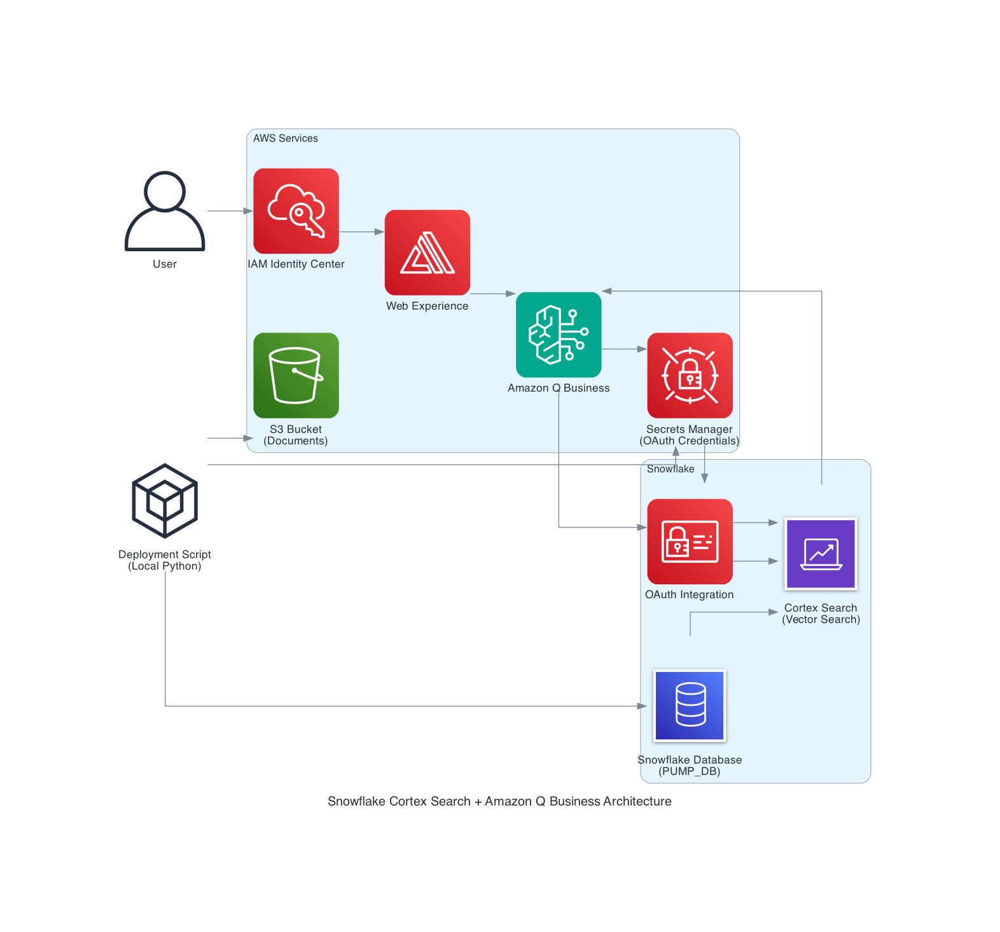
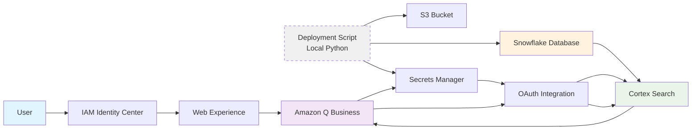
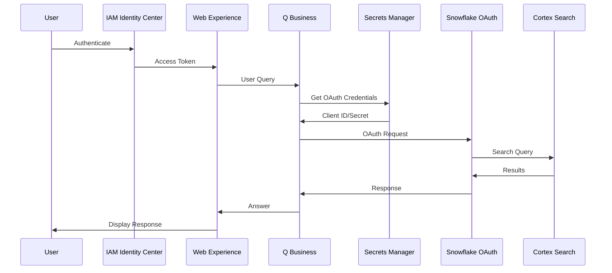

# Amazon Q Business Custom Plugin for Snowflake Cortex Search

*Automated deployment of a custom plugin connecting Amazon Q Business to Snowflake Cortex Search for natural language queries over your enterprise data.*

[](LICENSE)
[](https://python.org/)
[](https://aws.amazon.com/cdk/)

## Introduction

This solution demonstrates **Amazon Q Business Custom Plugins** by automating the integration with Snowflake Cortex Search. Custom plugins enable Amazon Q Business to connect with third-party applications through OpenAPI specifications, allowing users to query data using natural language.

This automated deployment transforms the manual 15+ step process from the [Snowflake quickstart guide](https://quickstarts.snowflake.com/guide/getting_started_with_amazon_q_business%20and_cortex/index.html#0) into a single command, accelerating custom plugin deployment for your organization.


## Getting Started

#### Prerequisites:

**Required Accounts:**
* AWS Account with Amazon Q Business access
* Snowflake Account with Cortex Search enabled
* IAM Identity Center instance configured

**Required Software:**
* Python 3.8+ installed locally (verify with `python --version` or `python3 --version`)
* Node.js and npm installed (verify with `node --version` and `npm --version`)
* AWS CLI installed and configured with credentials (verify with `aws sts get-caller-identity`)

**First Time Setup:**
* If you don't have AWS CLI configured, run `aws configure` and enter your access keys
* If you don't have IAM Identity Center, create one in the AWS Console first

## Setup

**Step 1: Clone and navigate to the project:**

```bash
git clone https://github.com/william-screen/sample-snowflake-plugin-for-amazon-q-business.git
cd sample-snowflake-plugin-for-amazon-q-business/cdk-snowflake
```

**Step 2: Create Python Virtual Environment:**

```bash
# Create virtual environment (use python or python3 depending on your system)
python -m venv venv
# If that fails, try: python3 -m venv venv

# Activate virtual environment
# On macOS/Linux:
source venv/bin/activate
# On Windows:
# venv\Scripts\activate

# Verify activation (should show path to venv)
which python
```

**Step 3: Configure Environment Variables:**

```bash
# Copy environment template
cp .env.example .env

# Edit .env file with your actual values:
# Snowflake Configuration
SNOWFLAKE_ACCOUNT=your-account-identifier
SNOWFLAKE_USER=your-snowflake-username
SNOWFLAKE_PASSWORD=your-snowflake-password
SNOWFLAKE_WAREHOUSE=COMPUTE_WH
SNOWFLAKE_DATABASE=PUMP_DB
SNOWFLAKE_SCHEMA=PUBLIC
SNOWFLAKE_ROLE=your-snowflake-role

# AWS Configuration
AWS_REGION=us-east-1
IDENTITY_CENTER_INSTANCE_ARN=arn:aws:sso:::instance/ssoins-xxxxxxxxx

# CDK Configuration
CDK_DEFAULT_ACCOUNT=123456789012
CDK_DEFAULT_REGION=us-east-1

# Optional: Stack naming
STACK_NAME=SnowflakeQBusinessRagStack
```

**Step 4: Deploy the infrastructure.**

Single command deployment (~5-10 minutes):

```bash
# Make sure virtual environment is activated
source venv/bin/activate

# Set AWS region and deploy everything
export AWS_REGION=us-east-1
./scripts/deploy.sh
```

This automatically handles:
- AWS infrastructure (Q Business, S3, IAM, Secrets Manager)
- Snowflake setup (warehouse, database, Cortex Search)
- Document processing and OAuth configuration

**Step 5: Assign User Access:**

1. Go to Amazon Q Business Console → **Applications**
2. Select your application → **Manage user access**
3. Select **Add users and groups** → Choose your IAM Identity Center users/groups
4. Assign subscription tier (Q Business Lite or Pro) → **Confirm**
5. Users can now access the Web Experience URL with their IAM Identity Center credentials

**Step 6: Test Access:**

1. Open private browser window → Navigate to Web Experience URL
2. Sign in with IAM Identity Center credentials
3. Test with sample query to verify integration

**Troubleshooting:** 

**Common Issues:**
- **"Amazon Q was not configured correctly"**: Ensure your Q Business application and IAM Identity Center are in the same AWS region
- **"Permission denied" errors**: Make sure your AWS CLI has sufficient permissions (try `aws sts get-caller-identity` to verify)
- **Virtual environment not working**: Deactivate with `deactivate`, delete the `venv` folder, and recreate it
- **Deploy script fails**: Check that all environment variables in `.env` are filled out correctly

**Getting Help:**
- Check AWS CloudFormation console for detailed error messages if deployment fails
- Verify your Snowflake credentials by logging into Snowflake web console first

## Usage

Ask natural language questions about your documents:

- *"What is the part description for part number G4204-68741?"*
- *"What are the pump head assembly parts?"*
- *"What are the steps for replacing the heat exchanger?"*

## Reference Architecture



The solution creates a secure integration between Amazon Q Business and Snowflake with the following components:

* **Amazon Q Business Application**: Conversational AI interface with IAM Identity Center authentication
* **Snowflake Cortex Search**: Vector search over processed documents
* **S3 Bucket**: Document storage and processing
* **Deployment Script**: Local Python automation (not AWS Lambda)
* **Secrets Manager**: Secure OAuth credential storage
* **IAM Roles**: Least-privilege permissions for service integration

### Data Flow



### Authentication Flow



## Project Structure

```
cdk-snowflake/
├── lib/                    # CDK stack definitions
├── src/automation/         # Deployment automation scripts
├── scripts/                # Deployment and utility scripts
├── docs/                   # Documentation and diagrams
│   └── generated-diagrams/ # Architecture diagrams
├── requirements.txt        # Python dependencies
└── package.json           # Node.js dependencies
```

## Cleanup

```bash
source venv/bin/activate
cdk destroy
```

This removes all AWS resources. Snowflake resources remain and need manual cleanup if desired.

## Contributing

See [CONTRIBUTING.md](CONTRIBUTING.md) for contribution guidelines.

## License

This project is licensed under the MIT-0 License. See [LICENSE](LICENSE) for details.

## Security

See [CONTRIBUTING.md](CONTRIBUTING.md#security-issue-notifications) for security issue reporting.
